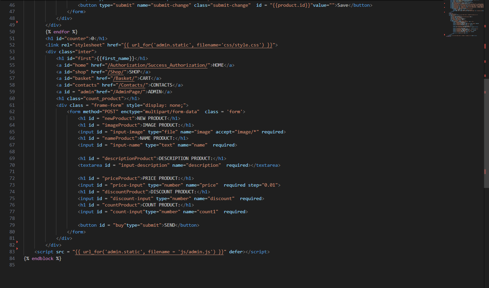
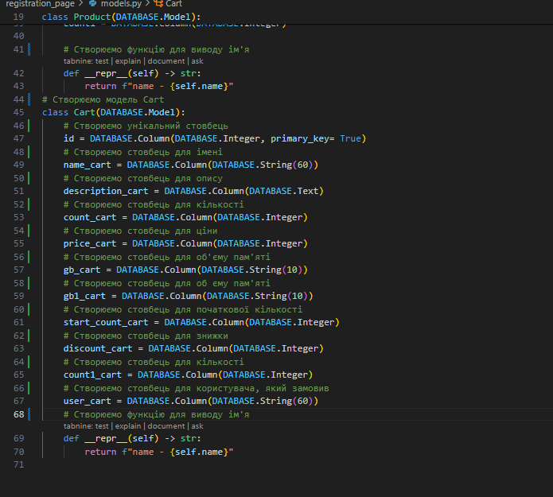

# Shop-Site

---
## Цей проєкт створювали:

**Ващенко Артем**: https://github.com/VashchenkoArtem

**Лялін Артем**: https://github.com/artem409

**Фелікс Деньга**: https://github.com/Feliks2010

---

#### **Shop-Site** це інтернет-магазин, в якому можна:
- **Зареєструватися**
- **Війти** до свого акаунту
- **Придбати** товари
- **Видалити** або **додати** товар (якщо ви **адміністатор**)
- **Зв'язатися** з продавцем

### Альтернативна демо-версія сайту: https://artem124509.pythonanywhere.com/

Цей проєкт дуже корисний для **новачків** тим, що цей проєкт
**містить** всі необхідні можливості для **створення вебсайту** на **замовлення**

Особливо для нашої **команди** цей проєкт **корисний** тим, що під час його створення ми навчилися **працювати** з **міграціями** та **github**, створювати **сайти** та **деплоїти** їх на **pythonanywhere** та **комунікувати** в команді

В проєкті використовувалися такі модулі: 
- **flask** (створення сайту)
- **pandas** (для зчитування данних з exсel)
- **flask_SQlalchemy, flask_migrate** (створення міграцій)
- **flask_login** (авторизація користувача)
- **flask_mail** (відправка повідомлення про замовлення на пошту)
- **telebot** (створення бота в телеграмі)
- **os** (встановлення шляхів)

### Інструкція по запуску проєкта на комп'ютері (локально):
1. Перейдіть  за **посиланням**: https://github.com/VashchenkoArtem/Shop-Site і натиснути на кнопку **Code**

2. **Натисніть** у відкритому вікні **Download ZIP**

3. **Розпакуйте** zip-папку
4.  **Запустіть Visual Studio Code** 
5.  **Натисніть** кнопку **Open Folder**

6. **Відкрийте** деректорію, по якій ви **зберегли** папку **проекта**
7. **Перейдіть** в файл **manage.py**

8. **Відкрийте** термінал, натиснувши на **Terminal**

9. **Встановіть** всі необхідні **модулі**, якщо вони не встановлені

```python
pip install flask flask_sqlalchemy flask_migrate flask_login pandas os flask_mail telebot
```
10.  **Натисніть** на **трикутничок** в правому верхньому куті **екрана**

11.  Коли в **терміналі** з'явилися нові повідомлення **зажміть ctrl** на клавіатурі та **натисніть** на посилання до **сайту**


### Інструкція до запуску проєкта на pythonanywhere
1. **Перейти** на **сайт** pythonanywhere
2. **Зареєструватися** там, якщо ще не зареєстровані
3. **Створюємо** нову **bash** консоль

4. **Клонуємо** репозиторій. Прописуємо в консолі:
```
git clone https://github.com/VashchenkoArtem/Shop-Site
```
5. **Створюємо** віртуальне оточення
```
mkvirtualenv <Назва віртуального оточення> --python=python3.10
```
6. **Встановлюємо** всі необхідні модулі
```
pip install flask flask_sqlalchemy flask_migrate flask_login pandas  flask_mail telebot
```
7. **Виходимо** з консолі, **натиснувши** стрілочку наліво в лівому верхньому кутi та **заходимо** у вкладку **Web**


8. Створюємо додаток натиснувши на кнопку **Add a new app** і далі **натискаємо** на **Next**

9. **Обираємо** framework **Flask** і натискаємо **Next**

10.  **Обираємо** версію **Python 3.10**

11. **Натискаємо Next**
12. **Прогортаємо** трохи нижче та знаходимо **Working directory** і **натискаємо** на деректорію, яка знаходиться трохи **правіше**


13.  **Змінюємо** деректорію на:
```
/home/Ваше ім'я акаунту/Shop-Site
```
14.   Нижче **знаходимо WSGI configuration file** і **натискаємо** на посилання **правіше**

15.   **16 рядок** кода **змінюємо** на:
```
from project.settings import project_login as application
```
16.   **Натискаємо** на кнопку **Save**


17. **Виходимо** з коду через стрілочку в лівому верхньому куті екрана, **знаходимо Enter path to a virtualenv, if desired** та **натискаємо** на неї

18.  В полі **вводимо**:
```
/home/Ваше Ім'я Акаунту/.virtualenvs/site_venv
```
19. **Натискаемо на галочку**

20. **Перезапускаємо** проєкт

21. **Натискаємо** на назву нашого **проєкту**


### Структура проєкту з описом кожного його додатків

- Додаток **main_page** відповідає за відображення **головної сторінки** і **можливості** перейти на сторінку **реєстрації** або **авторизації**
- Додаток **registration_page** відповідае за **рєстрацію користувача**
- Додаток **success_registration** відповідає за **відображення сторінки** з повідомленням, що користувач **успішно** зареєструвався і посиланням на **основну сторінку**
- Додаток **login_page** відповідає за **авторизацію користувача**
- Додаток **success_authorization** відповідає за **успішне авторизування** користувача і **переходом** на **основну сторінку**
- Додаток **Shop_page** відповідає за сторінку **відображення товарів** з можливістю **перенесення** їх до кошика
- Додаток **cart_page** відповідає за **відображення товарів в кошику** і можливістю **придбати їх або зв'язатися з продавцем**
- У додатка **admin_page** схожа функція з додатком **Shop_page**, але відрізняється тим, що в **admin_page** можна **додати товар**, **видалити товар** або **змінити його дані**
- Папка **bot_app** відповідає за **телеграм бота**
- Папка **project** відповідає за **створення основного додатку Flask, створення міграцій, за базовий шаблон html, додавання посилання іншим додаткам та реєстрація додатків до головного додатку Flask**
- Файл **manage.py** відповідає за **запуск** проєкту
- Файл **README.md** відповідає за опис проєкту
### Приклад створення головного додатку
1. **Створюємо** файл **settings.py** та **заповнюємо** його за прикладом:

2. **Створюємо** папку **templates** та в ній файл **base.html**, який заповнюємо приблизно так:

3. **Створюємо** файл **urls** , додаємо **посилання** кожному додатку і **реестрація** до головного додатку. **Приклад** створення файлу з **додаванням посилання** та **реєстрації** до головного додатку:    

4. Якщо у **проєкті** присутня **авторизація** та **реестрація**, то ми **створюємо** файл **login_manager** за прикладом:
  
5. Якщо ви хочете **відсилати повідомлення на пошту**, то вам треба буде **створити** файл **mail_config.py**. **Приклад** його створення:

6. **Останній файл**, який треба **створити** для **головного додатку** - файл **__init.py__** в якому ми **імпортуємо** все з файлу **urls.py**, **головний додаток** з файлу **settings.py** та все з файлу **login_manager.py**

### Приклад створення Blueprint додатку
1. Створення **app.py**, в якому створюємо об'єкт з класом **Blueprint**. Задаємо йому параметри **name, import_name, template_folder, static_folder**. Приклад **app.py**

2. Створення **папки з html файлом**, в якій ми спочатку **єкспортуємо базовий шаблон**, створений в **головному проєкті**, а далі через **jinja** пишемо код, який потрібно

3. Створення файлу **views.py** в якому ми **створюємо функцію** для **відображення** сторінки

4. Файл **init** в який ми імпортуємо з файлу **app.py** об'єкт **Blueprint**, а з **views.py** імпортуємо функцію **відображення**

### HTML Шаблони проєкту
- В шаблоні **home.html** ми створили 2 посилання - **REGISTRATION** та **AUTHORIZATION** та текст з класом **centered** 

- В шаблоні **register.html** створено **форму з методом POST, 4 напису, 4 input кнопки, в які треба вводити дані і кнопку send**

- В шаблоні **autho.html** створено **форма з методом POST** для вводу даних, щоб **авторизуватись**

- В шаблоні **autho_success.html** створено 4 **посилання** і **напис** посередені екрану та якщо ти **адмін** з'являється п'яте **посилання з переходом на сторінку адміна**

- В шаблоні **shop_app.html** створено об'єкти, які містять в собі **все про продукт (ім'я, ціну, знижку, картинку, ціну зі знижкою)**


- В шаблоні **cart.html** створено **умову** чи є продукт в кошику, **форму**, яка служить, як **модальне вікно** та **відображення товару**, який перенесли в **кошик**


- В шаблоні **admin.html** схожий вигляд з шаблоном **shop_app.html**, але в цьому шаблоні є ще **додавання товару, видалення товару та змінення даних про товар**



### Файли views.py кожного з додатків
1. Файл **views.py** додатку **main_page**
    - В цьому файлі створена функція, яка **відображає** сторінку(скріншот кода я показував вище)
2. Файл **views.py** додатку **registration_page**
    - **Функція** цього файлу **потрібна не лише для відображення сторінки**, а ще й для **створення користувача** і **запис його даних до моделі User**
    
3. Файл **views.py** додатку **login_page**
    - В цьому **views.py** виконується **перевірка** правильно користувач ввів свій **пароль** чи ні, **перевірка авторизації користувача** і **перехід** на сторінку **успішної авторизації**
    

4. Файл **views.py** додатку **success_authorization**
    - В цьому файлі створена **перевірка** користувача на **адміна**
    

5. Файл **views.py** додатку **Shop_page**
    - В цьому файлі **зчитуються** дані з таблиці **excel** та по цим даним **створюється** об'єкт **продукту**. Ще в цьому файлі є **перевірка на адміністратора користувача**
    
    

6. Файл **views.py** додатку **cart_page**
    - В цьому файлі при **додаванні продукту** в кошик **id** продукту **додається в cookie**. Далі, коли користувач **натиснув** кнопку **оформити замовлення** дані **зчитуються** і **створюється** продукт за цими даними і**відбувається** **відправка** повідомлення на **пошту та в телеграм бота продавцю**
    
    
7. Файл **views.py** додатку **admin_page** 
    - В цьому файлі ми **зробили додавання** **нових** продуктів та їх **запис** в базу даних, **видалення** продуктів та **редагування** даних продуктів
    
    
    

### Опис файлу **models.py** 
В файлі **models.py** ми створили **3 моделі** а саме:
- **User** (користувачі)
    - В цій базі даних ми створили **поля** для **імені**, **паролю** та **адміністратора**
- **Product** (товари)
    - Ця база даних створена для того, щоб **записувати** туди **ім'я, ціну, знижку, опис та об'єм пам'яті**
- **Cart** (кошик)
    - Ця база даних **однакова** з моделлю **Product**, але товар **додається** сюди тільки після **оформлення замовленя**


### Проведення міграцій
Щоб провести міграції треба:
1. **Переконатися**, що в проєкті створено **все** для **проведення міграцій**
2. **Відкрити термінал** і **перейти** в папку, в якій **створено** файл **settings.py**
3. **Ввести** в термінал **команду** для **ініцилізації**, якщо міграції проводяться **вперше**:
```
flask --app settings db init
```
4. **Ввести** в термінал **команду** для **міграцій**:
```
flask --app settings db migrate
```
5. **Ввести** в термінал **команду** для оновлення **міграцій**:
```
flask --app settings db upgrade
```
6. **Міграцію успішно проведено!**

### База даних

**База даних** - структурована **інформація**, яка керується **системами управління базами даних**

**Чому саме SQLite3?**
Зазвичай люди обирають саме **SQLite3** через те, що в ній **легко працювати** та **налаштовувати використання**, має **велику продуктивність** **для невеликих** та **середніх додатків**, має **шифрування** та **безкоштовне**

#### Id в базі даних
**Яку роль виконує id в базі даних?**
**ID** - **стовбець**, який гарантує **унікальність** кожного об'єкта в базі даних

### JavaScript
В нашому проєкті є декілька **файлів JS**. Почнемо з **home.js** в цьому файлі ми **дізнаємося cookie** і **створюємо умову**. Якщо **cookie дорівнює 0**, тобто **пустий**, то ми **ховаємо** наш об'єкт з **кількістю продуктів**, якщо **більше 0** - ми **додаємо йому дизайн та показуємо**


Наступний файл - **set_cookies.js**. В цьому файлі **є така ж умова**, як в  **home.js** і **функція** для того, щоб **дізнатися ціну** з врахуванням **знижки** на товар


Файл  **workCookies.js** - файл в якому є **умова**, яка була в **home.js** і **функція**, яка була в **set_cookies.js**, але це не все. В файлі **присутні 2 нових функції**, які потрібні для **додавання** або **віднімання** товару і функція, яка **змінює display** **модальному** **вікну** **оформлення замовлення**


Останній файл - **admin.js**. В цьому файлі теж є функції **home.js** та **set_cookie.js**, але це не всі функції. В цьому файлі відбувається **змінення даних товару**. Наприклад **картинки** або **імені**


### Висновки

Завдяки цьому проєкту ми навчилися **створювати сайти**, **працювати з міграціями**, **повторили телебота** та **почали вивчати JavaScript** та **HTML**.
Я вважаю, що проєкт **дуже корисний**, особливо для **новачків**, таких як ми, бо цей проєкт має усі **необхідні можливості** для **створення** **повноцінного вебсайту для замовника**. Іноді було важко працювати над ним, але проєкт дуже **важливий** і **корисний**, особливо для **новачків**. Особисто для мне цей проєкт **дуже корисний**.

# Shop-Site

---
## This project was created by:

**Vashchenko Artem**: https://github.com/VashchenkoArtem

**Lyalin Artem**: https://github.com/artem409

**Felix Denga**: https://github.com/Feliks2010

---

#### **Shop-Site** is an online store where you can:
- **Sign up**
- **Sign in** to your account
- **Buy** products
- **Remove** or **add** a product (if you are an **administrator**)
- **Contact** the seller

### Alternative demo version of the site: https://artem124509.pythonanywhere.com/

This project is very useful for **newbies** because this project
**contains** all necessary features for **website creation** on **order**

Especially for our **team**, this project is **useful** because during its creation we learned to **work** with **migrations** and **github**, create **sites** and * *deploy** them on **pythonanywhere** and **communicate** in a team

The following modules were used in the project: 
- **flask** (site creation)
- **pandas** (for reading data from Excel)
- **flask_SQlalchemy, flask_migrate** (creation of migrations)
- **flask_login** (user authorization)
- **flask_mail** (sending an order message to the mail)
- **telebot** (creating a bot in Telegram)
- **os** (setting paths)

### Instructions for launching the project on a computer (locally):
1. Go to the **link**: https://github.com/VashchenkoArtem/Shop-Site and click on the **Code** button

2. **Click** in the open window **Download ZIP**

3. **Unzip** the zip folder
4. **Start Visual Studio Code** 
5. **Click** the **Open Folder** button

6. **Open** the directory where you **saved** the **project** folder
7. **Go** to the file **manage.py**

8. **Open** Terminal by clicking on **Terminal**

9. **Install** all necessary **modules** if they are not installed

```python
pip install flask flask_sqlalchemy flask_migrate flask_login pandas os flask_mail telebot
```
10. **Click** on the **triangle** in the upper right corner of the **screen**


11. When new messages appeared in the **terminal**, **hold down ctrl** on the keyboard and **click** on the link to the **site**


### Instructions for starting a project on pythonanywhere
1. **Go** to the **site** pythonanywhere
2. **Register** there, if not already registered
3. **Create** a new **bash** console

4. **Clone** the repository. We write in the console:
```
git clone https://github.com/VashchenkoArtem/Shop-Site
```
5. **We create** a virtual environment
```
mkvirtualenv <Name of virtual environment> --python=python3.10
```
6. **Install** all necessary modules
```
pip install flask flask_sqlalchemy flask_migrate flask_login pandas flask_mail telebot
```
7. **Exit** the console by **clicking** the arrow to the left in the upper left corner and **go** to the **Web** tab


8. Create an application by clicking the **Add a new app** button and then **click** **Next**

9. **Choose** the **Flask** framework and click **Next**

10. **Select** version **Python 3.10**

11. **Click Next**
12. **Scroll** a little below and find **Working directory** and **click** on the directory that is located a little **to the right**


13. **Change** the directory to:
```
/home/Your Account Name/Shop-Site
```
14. Below **find the WSGI configuration file** and **click** on the link **on the right**

15. **line 16** of the code **change** to:
```
from project.settings import project_login as application
```
16. **Click** on the **Save** button


17. **Exit** the code through the arrow in the upper left corner of the screen, **find Enter path to a virtualenv, if desired** and **click** on it

18. In the **enter** field:
```
/home/Your Account Name/.virtualenvs/site_venv
```
19. **Click on the checkmark**

20. **Restart** the project

21. **Click** on the name of our **project**


### The structure of the project with a description of each of its applications

- The **main_page** application is responsible for displaying the **main page** and the **ability** to go to the **registration** or **authorization** page
- **registration_page** application is responsible for **user registration**
- The **success_registration** application is responsible for **displaying a page** with a message that the user has **successfully** registered and a link to the **main page**
- **login_page** application is responsible for **user authorization**
- The **success_authorization** application is responsible for **successful authorization** of the user and **transition** to the **main page**
- The **Shop_page** application is responsible for the **product display** page with the possibility of **moving** them to the cart
- The **cart_page** application is responsible for **displaying the products in the cart** and the ability to **buy them or contact the seller**
- The **admin_page** application has a similar function to the **Shop_page** application, but differs in that in **admin_page** you can **add a product**, **delete a product** or **change its data* *
- The **bot_app** folder is responsible for the **telegram bot**
- The **project** folder is responsible for **creating the main Flask application, creating migrations, for the basic html template, adding links to other applications and registering applications to the main Flask application**
- The file **manage.py** is responsible for **starting** the project
- The file **README.md** is responsible for the description of the project

### An example of creating the main application
1. **Create** the **settings.py** file and **fill** it according to the example:

2. **Create** the **templates** folder and in it the **base.html** file, which we fill in approximately as follows:

3. **Create** a **urls** file, add **links** to each application and **registration** to the main application. **Example** of creating a file with **adding a link** and **registration** to the main application:    

4. If **authorization** and **registration** are present in the **project**, then we **create** the **login_manager** file according to the example:

5. If you want to **send messages to mail**, you will need to **create** a **mail_config.py** file. **Example** of its creation:

6. The **last file** that must be **created** for the **main application** is the **__init.py__** file in which we **import** everything from the **urls.py** file , **main application** from the file **settings.py** and everything from the file **login_manager.py**

### An example of creating a Blueprint application
1. Creating **app.py**, in which we create an object with the **Blueprint** class. We set the parameters **name, import_name, template_folder, static_folder** to it. Example **app.py**

1. Creating a **folder with an html file**, in which we first **export the basic template** created in the **main project**, and then use **jinja** to write the required code

1. Creating a **views.py** file in which we **create a function** to **display** the page

1. The **init** file into which we import the **Blueprint** object from the **app.py** file, and import the **display** function from **views.py**

### HTML Project templates
- In the template **home.html** we created 2 links - **REGISTRATION** and **AUTHORIZATION** and text with class **centered** 

- In the **register.html** template, a **form with the POST method, 4 inscriptions, 4 input buttons for entering data and a send button** has been created

- In the **autho.html** template, a **form with POST method** is created for entering data to **authorize**

- In the **autho_success.html** template, 4 **links** and **inscription** are created in the middle of the screen, and if you are an **admin**, a fifth **link with a transition to the admin page** appears

- In the **shop_app.html** template, objects are created that contain **everything about the product (name, price, discount, picture, price with discount)**


- In the template **cart.html** there is a **condition** whether the product is in the cart, a **form** that serves as a **modal window** and a **display of the product** that was moved to * *basket**


- The template **admin.html** looks similar to the template **shop_app.html**, but this template also has **adding a product, removing a product and changing product data**


### Views.py files of each of the applications
1. The **views.py** file of the **main_page** application
    - In this file, a function is created that **displays** the page (I showed a screenshot of the code above)
2. The **views.py** file of the **registration_page** application
    - **The function** of this file is **required not only for displaying the page**, but also for **creating a user** and **writing his data to the User model**
    
3. The **views.py** file of the **login_page** application
    - In this **views.py**, **check** whether the user entered his **password** correctly or not, **checking user authorization** and **moving** to the **successful authorization** page are performed
    

4. The **views.py** file of the **success_authorization** application
    - In this file **user check** for **admin** is created
    
5. The **views.py** file of the **Shop_page** application
    - This file **reads** data from an **excel** table and **creates** a **product** object based on this data. Also in this file there is a **check for the user administrator**
    
    

6. The **views.py** file of the **cart_page** application
    - In this file, when **adding a product** to the cart, the **id** of the product is **added to the cookie**. Next, when the user **presses** the **place order** button, the data is **read** and a product is **created** based on this data and** a message is **sent** to **mail and in bot telegram to seller**
    
    
7. The **views.py** file of the **admin_page** application 
    - In this file, we **added** **new** products and **recorded** them in the database, **deleted** products and **edited** product data
    
    
    

### File description **models.py** 
In the file **models.py** we created **3 models** namely:
- **User** (users)
    - In this database we created **fields** for **name**, **password** and **administrator**
- **Product** (goods)
    - This database is created to **write** there **name, price, discount, description and storage capacity**
- **Cart**
    - This database is **the same** as the **Product** model, but the product is **added** here only after **ordering**


### Carrying out migrations
To carry out migrations, you must:
1. **Make sure** that **everything** has been created in the project to **conduct migrations**
2. **Open the terminal** and **go** to the folder where the **settings.py** file was **created**
3. **Enter** the **command** in the terminal for **initialization** if migrations are being carried out **for the first time**:
```
flask --app settings db init
```
4. **Enter** the **command** for **migrations** in the terminal:
```
flask --app settings db migrate
```
5. **Enter** the **command** in the terminal to update **migrations**:
```
flask --app settings db upgrade
```
6. **Migration successfully completed!**

### Database

**Database** - structured **information** that is managed by **database management systems**

**Why SQLite3?**
People usually choose **SQLite3** because it is **easy to work with** and **customize**, has **great performance** **for small** and **medium applications**, has **encryption** and **free**

#### Id in the database
**What is the role of id in the database?**
**ID** - a **column** that guarantees the **uniqueness** of each object in the database

### JavaScript
There are several **JS files** in our project. Let's start with **home.js** in this file we **learn the cookie** and **create the condition**. If **cookie is 0**, i.e. **empty**, then we **hide** our object with **number of products**, if **more than 0** - we **add design to it and we show**


The next file is **set_cookies.js**. This file **has the same condition** as in **home.js** and a **function** to **find out the price** including the **discount** of the item


The file **workCookies.js** is a file in which there is a **condition** that was in **home.js** and a **function** that was in **set_cookies.js**, but it is not all. The file **contains 2 new functions** that are required for **adding** or **subtracting** the product and a function that **changes the display** of the **modal** **window** **order processing **


The last file is **admin.js**. This file also contains **home.js** and **set_cookie.js** functions, but these are not all functions. In this file there is a **change of product data**. For example **pictures** or **names**


### Conclusions

Thanks to this project, we learned to **create sites**, **work with migrations**, **repeated telebot** and **started to learn JavaScript** and **HTML**.
I think the project is **very useful**, especially for **newbies** like us, because this project has all the **necessary features** to **create** a **full-fledged website for a customer**. Sometimes it was difficult to work on it, but the project is very **important** and **useful**, especially for **newbies**. Personally, this project is **very useful** for me.